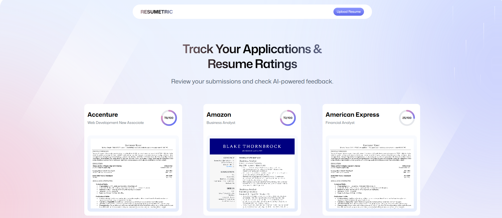
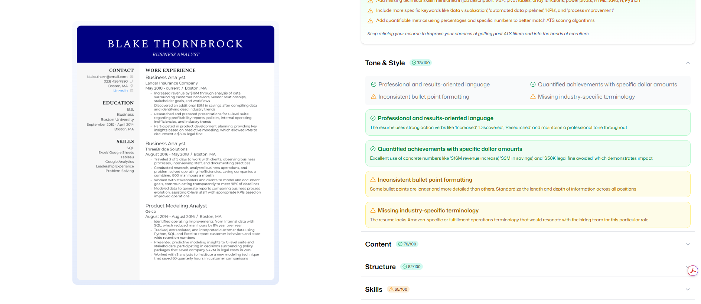

# Resumetric: Your AI-Powered Resume Analyzer

## Overview

In the competitive job market, a perfectly crafted resume can be your gateway to success. **Resumetric** is an intelligent web application designed to empower job seekers and streamline the resume screening process. Leveraging cutting-edge Artificial Intelligence, it provides instant, comprehensive feedback on resumes, helping users optimize their applications for maximum impact.

Say goodbye to endless revisions and guesswork. Simply upload your PDF resume, and let Resumetric provide a data-driven analysis, ensuring your strengths shine through.

---

## Key Features & Benefits

Resumetric is more than just a tool; it's your personal resume coach.

* ** AI-Powered Analysis:**
    * Get intelligent insights into your resume's strengths and weaknesses.
    * Receive suggestions for keywords, formatting, readability, and content optimization.
    * Gain a competitive edge by tailoring your resume precisely to job requirements.

* ** Seamless PDF Integration:**
    * Effortlessly upload your PDF resumes with a intuitive drag-and-drop interface.
    * **Unique Feature: On-the-Fly PDF to Image Conversion:** Resumetric automatically converts your PDF resume's first page into a high-quality image preview, providing immediate visual feedback without needing to open the PDF. This allows for quick, scannable overviews within the application.

* ** Fully Responsive & Intuitive UI/UX:**
    * Crafted with **React** and styled beautifully with **Tailwind CSS**, the application offers a clean, modern, and highly responsive user interface.
    * Enjoy a consistent and engaging experience across all devices – desktops, tablets, and mobile phones.
    * User authentication for secure and personalized access.

---

## 🚀 Live Demo

Experience Resumetric live: [https://ai-resume-analyzer-six-sage.vercel.app](https://ai-resume-analyzer-six-sage.vercel.app)

---

## 📸 Screenshots

_To add screenshots, create a folder named `screenshots` (or `assets`) in your GitHub repository's root. Then upload your images there and use the paths like shown below._


_A clean and intuitive Home page._


_Easily upload your resume with drag-and-drop functionality._


_Instant visual preview of your PDF resume after upload._


_Comprehensive AI-generated insights and recommendations._

---

## 🛠️ Tech Stack

* **Frontend:**
    * [React](https://react.dev/) - A declarative, efficient, and flexible JavaScript library for building user interfaces.
    * [Vite](https://vitejs.dev/) - Next generation frontend tooling for a blazing fast development experience.
    * [TypeScript](https://www.typescriptlang.org/) - A superset of JavaScript that adds static types.
    * [Tailwind CSS](https://tailwindcss.com/) - A utility-first CSS framework for rapidly building custom designs.
    * [React Router](https://reactrouter.com/) - For declarative routing in your React applications.
    * [PDF.js](https://mozilla.github.io/pdf.js/) - For client-side PDF rendering and conversion to images.
* **Backend & Authentication:**
    * [Puter.js](https://puter.com/) - Integrated for backend services and authentication. 
* **AI Integration:**
    * _**Claude Sonnet 4**_

---

## 🏁 Getting Started (Local Development)

To get a copy of the project up and running on your local machine for development and testing purposes.

### Prerequisites

* Node.js (LTS version recommended)
* npm or Yarn

### Installation

1.  **Clone the repository:**
    ```bash
    git clone [https://github.com/gurnoorkaur-13/ai-resume-analyzer.git](https://github.com/gurnoorkaur-13/ai-resume-analyzer.git)
    cd ai-resume-analyzer
    ```
2.  **Install dependencies:**
    ```bash
    npm install
    # or
    yarn install
    ```
3.  **Build the project for production (optional, but good to test):**
    ```bash
    npm run build
    ```
    This will create a `build` directory in your project root.

4.  **Run the development server:**
    ```bash
    npm run dev
    # or
    yarn dev
    ```
    The application will be available at `http://localhost:5173/` (or another port if 5173 is in use).

